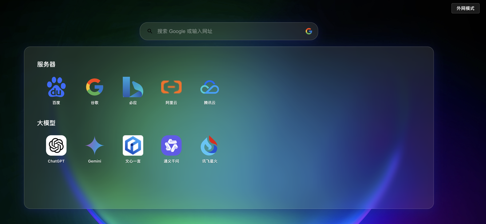

## 一个简单的导航、首页面板

## 系统截图


## Docker安装方式（系统默认用户名：admin，密码：admin123，可在config/auth.json中修改）

### 快速启动
```bash
docker run -d --name clover-panel -p 82:80 c0w0c/clover-panel
```

### 持久化存储
```bash
# 创建数据目录
mkdir -p /data/clover-panel/db
mkdir -p /data/clover-panel/uploads

# 启动容器并挂载数据目录
docker run -d \
  --name clover-panel \
  -p 82:80 \
  -v /data/clover-panel/db:/app/server/db \
  -v /data/clover-panel/config:/app/server/config \
  -v /data/clover-panel/uploads:/app/server/uploads \
  c0w0c/clover-panel
```

### 使用 Docker Compose
```yaml
services:
  clover-panel:
    image: c0w0c/clover-panel
    container_name: clover-panel
    ports:
      - "82:80"
    volumes:
      - /data/clover-panel/db:/app/server/db
      - /data/clover-panel/config:/app/server/config
      - /data/clover-panel/uploads:/app/logo
    restart: unless-stopped
```

保存为 `docker-compose.yml` 后运行：
```bash
docker-compose up -d
```

## 数据目录说明
- `/data/clover-panel/db`: 存储 SQLite 数据库文件
- `/data/clover-panel/logo`: 存储上传的图标文件
- `/data/clover-panel/config`: 配置文件目录

## 注意事项
1. 请确保挂载目录具有适当的权限
2. 首次启动后会自动创建数据库
3. 建议定期备份数据目录